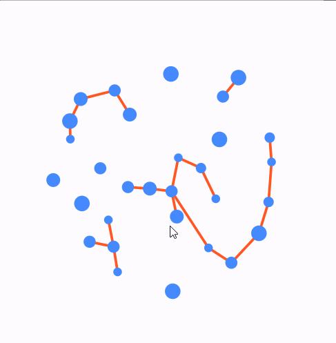

# Flutter Force-Directed Algorithm Simulation

## Overview

This Flutter project is an implementation of a Force-Directed Algorithm to simulate the behavior of
particles in a virtual environment.

### Key Features

- **Attractive Force to the Center**: Each particle is attracted to the center of the screen,
  creating a captivating central focal point.

- **Repulsive Forces Between Particles**: Particles naturally repel each other when they get too
  close, simulating the way real-world particles interact.

- **Attractive Edges**: The edges connecting particles exert an attractive force, ensuring that
  particles stay connected and move together as interconnected communities.

## Demo



## Getting Started

### Prerequisites

Before you begin, ensure you have met the following requirements:

- Flutter: [Installation Guide](https://flutter.dev/docs/get-started/install)

### Installation

1. Clone this repository:

   ```bash
   git clone https://github.com/ramin-vakili/force_directed_graph.git 
   
2. Navigate to the project:

   ```bash
   cd foce_directed_graph
   
3. Install dependencies:

   ```bash
   flutter pub get
   
4. Run

   ```bash
   flutter run